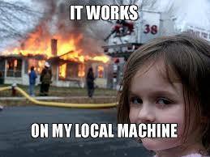
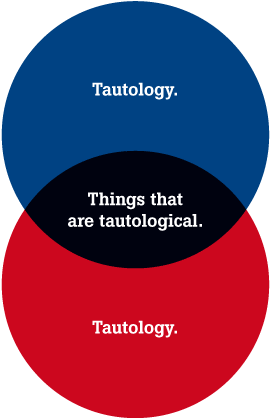

# Como asegurar que un software no tenga defectos

## ¿Es imposible?

<aside class="notes">
Durante el desarrollo de software normalmente nos gusta que las cosas funcionen 
y funcionen bien, por una cosa de honor (y de que no nos hinche el area de 
calidad :p)
</aside>

 * Complejidad creciente
 * _Unknown unknowns_
 * Sistemas no funcionan en un vacío
    * left-pad
    * DIG
    * Equifax

<aside class="notes">
Los sistemas son entes complejos que toman vida propia gracias a una infinidad 
de piezas chicas que se comunican entre sí. Entonces, para un sistema no 
trivial, es muy muy complicado garantizar al 100% su comportamiento.

También hay cosas que simplemente no tenemos forma de saber desde un inicio. 
Hay formas de adelantarse a lo que va a ocurrir, tales como realizar estudios 
para analizar tendencias, o derechamente tener mucha experiencia en un area en 
particular. Sin embargo siempre hay imprevistos y requisitos que solo ocurren 
una vez ejecutado un proyecto.

Finalmente, incluso si hacemos todo bien, no podemos saber si es que vamos a 
tener algún tipo de roce con las dependencias de un proyecto. Por ejemplo: el 
autor de la libraría de javascript 'left-pad' quitó su proyecto de npm 
(repositorio de paquetes de javascript) y con eso rompió una gran cantidad de 
proyectos informáticos alrededor del mundo. Otro ejemplo: DIG.
</aside>

## Formas de atrapar defectos en el desarrollo de software

* Planificación
  * Requisitos claros
* Buenas prácticas
* *Pull Request*
* _Testing_

<aside class="notes">
Nosotros tenemos herramientas para atrapar problemas antes de que todo estalle 
en producción.

En primer lugar la planificación es esencial, ya que teniendo una dirección 
clara se puede desarrollar funcionalidad sin tener problemas de falta de 
definiciones o de requisitos ambiguos que generan errores porque nadie se dio 
cuenta que habían casos que debían ser manejados.

Las buenas prácticas pueden asegurar que, teniendo claro lo que se quiere 
implementar, se pueda ejecutar en la forma más eficiente y clara, permitiendo 
también tener un sistema que pueda cambiar a medida que se identifican nuevas 
necesidades (mantenibilidad).

Mediante el proceso de pull request nosotros podemos tener multiples ojos en 
una pieza de código. Con esto atrapamos errores burdos (una variable con un 
nombre distinto), problemas de estilo (código poco claro) e incluso sirve para 
aprender técnicas nuevas.

Finalmente, pero no menos importante, es hacer pruebas de lo que se desarrolló.
</aside>

## ¿Por qué hacer testing?

---

* Informar expectativas del código nuevo
* Asegurar que la funcionalidad nueva cumpla con sus requisitos
* Asegurar que la funcionalidad nueva se integre con el sistema actual
  * Que no rompa la aplicación

  > La función para verificar rut solo recibe 9 dígitos sin guión

<aside class="notes">
Los test en cierto sentido sirven como un contrato con el módulo nuevo. En 
ellos especificamos casos donde el software se espera que funcione en forma 
determinada.

Por lo tanto permite a desarrolladores que no son el autor (el cuál siempre 
confía en su código) saber si cumple con los requisitos que se le exigen. 
Ejemplo: Una validación de rut debería poder recibir un formato específico, por 
lo tanto se prueban con distintas variantes que tendrían que funcionar si o si.

También nos informan de que si hay funcionalidad nueva no va a repercutir en 
una parte completamente no relacionada mediante un efecto mariposa, ya que, 
asumiendo que el resto del sistema también tiene sus tests, estos deberían 
fallar en caso de que haya algo raro. Ejemplo: Cambié una validación del rut, 
pero en el sistema se usa la versión antigua, por lo tanto, los tests del 
sistema deberían fallar.

</aside>

## Tipos de testing

{#id .class height=65% width=65%} 

<aside class="notes">
En el gráfico se ve la relación entre cantidad de tests con respecto a su costo 
en tiempo y/o dinero. Deberían haber muchos tests unitarios, los que prueban un 
módulo específico, una cantidad menor de tests de integración, que prueban la 
interfaz entre distintos sistemas, tales como una base de datos,  y muy pocas 
pruebas end to end, las cuales prueban un proceso completo tal como lo haría un 
usuario. En particular se espera que el desarrollador trabaje a nivel de test 
unitario.
</aside>

## {data-background-iframe="https://www.youtube.com/embed/0GypdsJulKE?controls=0"}

# Testing en Frontend

## Particularidades

* Difícil tener un _oráculo de la verdad_
  * Backend: Definiciones precisas
  * Frontend: "Lo quiero un poco mas a la derecha"

<aside class="notes">
Todo software tiene distintas necesidades. En el backend hay mucha regla de 
negocio, la cual actúa como la verdad absoluta. En el frontend esto no es 
necesariamente cierto ya que hay mucho de subjetividad en lo que es correcto o 
no.
<aside>

___

* Difícil automatizar test visuales

<aside class="notes">
Hay herramientas para verificar que la interfaz no haya cambiado entre cambios, 
pero no hay nada que reemplace el juicio humano.
</aside>

## ¿Qué se puede hacer durante el desarrollo en frontend?
* Probar manualmente cada cambio.
* Usar herramientas para hacer _visual diffs_.
* Usar herramientas para probar la estructura de la página.
* Ver que al menos la página es compilada (_smoke test_).
* Verificar solo casos con una condición _fail/pass_ concreta.
  * Lógica vs presentación

<aside class="notes">
Al informático le encanta automatizar y los tests no son excepción. Por lo 
tanto probar manualmente cada implementación nueva es anathema, especialmente a 
medida que aumenta la complejidad del sistema.

Como se decía antes existen herramientas para ver que cambios hay entre dos 
pantallas, pero no son las mas rápidas, y además tienden a dar falsos positivos 
porque detectan cambios al pixel (¿hay herramientas con ML para esto?)

Otra alternativa es que al menos la estructura esté correcta. Esto implica que 
el html sea el adecuado para la página. Más adelante se mostrarán herramientas 
para ese tipo de tests.

Fallando todo lo anterior, es posible tener pruebas que solo muestren si los 
componentes nuevos no fallen. Un _smoke test_ es el equivalente a prender una 
máquina y ver que no empiece a soltar humo.

Últimamente se puede decidir dejar de lado la parte presentacional de los test 
y solo probar aquellas cosas que implican cambios de estado, o que tienen 
condiciones de aceptación/rechazo claras. Por ejemplo: Si se muestra una fecha 
solo probar que el texto se cree bien y con el formato específico, pero no 
preocuparse de que se vea.
</aside>

# Como probar en React

## En general

* Existen herramientas para:
  * ejecutar test unitarios en javascript (_runners_)
  * ayudar en el desarrollo de pruebas (_helpers_)

## Jest

* Test runner
* Ofrece utilidades para hacer asserts
<pre><code class="hljs">
    expect(fecha).toBe("06/06/2666");
    expect(fecha).not.toBe("05-04-33");
</code></pre>

___

* Ofrece utilidades para hacer _mocks_

<pre><code class="hljs">
jest.mock('../utils/tealium');
...

expect(tealium.sendView.mock.calls.length).toBe(1);
</code></pre>

<aside class="notes">
Básicamente reemplazar un módulo, en este caso tealium, por otro que no haga 
nada si es usado de la misma forma. La idea es que ayuda a que un test unitario 
de verdad dependa solo de un componente y no de alguna funcionalidad externa. O 
sea, es como hacer un "ceteris paribus" sobre el código.

Junto con lo anterior es necesario cuando se trata de servicios cuyo acceso es 
demasiado caro (tiempo, límite de accesos) para el contexto de un test que debe 
ser corrido multiples veces al día todos los días. Por ejemplo: La base de 
datos. Otro ejemplo: un servicio web tal como la SBIF, el cuál puede no estar 
siempre, y de estarlo, se demora segundos y más encima tiene un limite de 
llamadas por api.
</aside>

* Puede realizar comparaciones por _snapshots_

<pre><code class="hljs">
  expect(component).toMatchSnapshot()
</code></pre>

--- 

<pre><code class="hljs">
exports[`BackButton is rendered correctly when used with a string 1`] = `
<Jss(BaseButton)
  as={[Function]}
  className="primary rounded undefined"
  id="backButton"
  to="link"
  uppercase={false}
>
  <Component />
  <FormattedBackMessage
    defaultMessage="Default message"
    id="INTL_ID"
  />
</Jss(BaseButton)>
`;
</code></pre>

---

* El uso de snapshots es bueno para asegurar que la estructura de un componente 
  sea consistente.
* No asegura problemas visuales por interacciones.
* Acoplado a la implementación.
<aside class="notes">
Los snapshots ayudan al menos a saber que la página no cambió su layout 
interno.
No ayudan tanto a saber si algún elemento se corrió por culpa de alguna 
interacción, ya que solo guarda la estructura, no lo visual.
Si la implementación de la estructura cambia también cambia el snapshot, lo 
cual lo hace inestable si se trata de probar que una página se mantiene 
visualmente igual. Después de todo, puede cambiar todo lo interno de una página 
pero mantenerse igual de cara al usuario.
</aside>

## Enzyme

* Creado por _AirBnB_
* Herramienta con helpers para React.
 * Ej: Acceder a _states_, _props_, hijos
* _shallow rendering_
  * Solo se renderea componente.
  * Permite sumergirse en componentes hijos.
  * Evita testear dependencias.

<aside class="notes">
Ésta herramienta permite revisar a fondo un componente de react, pudiendo 
obtener props, estados. También da utilidades para montar los componentes en 
una versión reducida de un navegador.

De estas utilidades, la más importante es la habilidad de montar componentes 
usando shallow rendering. O sea, solo monta el componente, reemplazando algunas 
dependencias de tal forma que no sean llamadas. (mostrar codigo de mas 
atras)</aside>

## React Testing Library
>The more your tests resemble the way your software is used, the more 
>confidence they can give you.
> --Kent C. Dobbs

---

* Utilidades para montar componentes, simular eventos, etc.
* No usa _shallow rendering_ por diseño.
  * Monta el componente con todas sus dependencias.
  * Solo mocks a servicios muy lentos/críticos

<pre><code class="hljs">
  fireEvent.click(getByText('Test'));
</code></pre>

<aside class="notes">
La frase inicial del autor refleja como esta librería espera ser usada. Hace 
cosas similares a enzyme, pero se enfoca a ser usado "similar a como un usuario 
usaría la página". En la práctica implica que si se está probando el 
comportamiento del botón hay que buscarlo por su label (o id), simular el click 
y ver en la estructura de la página si hubo un cambio, en vez de revisar 
directamente el estado.

El argumento es que eso reduce el acoplamiento entre test y código. Si no se 
prueba basándose en estructuras internas es menos probable que un test se rompa 
por cambios que en realidad son mínimos, como el cambio de nombre de una 
propiedad que solo es usada internamente dentro del componente.</aside>

# Recomendaciones

## Enzyme vs React Testing Library

* Ambos hacen tareas similares.
* Distintos enfoques.

___

* Enzyme tiende a introducir más coupling con la implementación
  * Permite entrar con mayor detalle al estado del componente
  * Tendencia a que se rompan tests por cambios pequeños
  * Mas fácil para probar componentes que estén dentro de una estructura muy 
    profunda

___

* React Testing Library tiene el potencial de ser más robusto
  * Probar simulando a un usuario es bastante intuitivo
  * No acceder a estado interno no ha sido problema (hasta ahora)
  * Si se rompe test es más significativo
  * Componentes probablemente necesiten hacer un setup y/o mock de sus 
    prerequisitos

## Sobre los unit tests

* Importante pensar en pruebas que sean significativas.
  * Deben dar información si se rompen
<aside class="notes">
Ésto lo dijo James O Coplien en "Why most unit tests are a waste". Básicamente, 
un test que pasa siempre no da información del sistema. 
</aside>

___

* Testear solo lo no trivial

___

* Tests son código, y el código se mantiene
* Evitar escribir componentes gigantes.
  * Tienen más dependencias
  * Más fácil que se rompan.

<aside class="notes">
Así como hay que mantener el código del programa, los tests también deben ser 
mantenidos.
Si se hacen componentes muy complejos hacer los tests se hace mucho mas 
complicado. Por ende se hacen menos mantenibles y es más fácil que se rompan 
inexplicablemente.
</aside>

---

## Sobre snapshots

* Snapshots son útiles en ciertos casos:
  * Componentes de presentación.
  * Comportamiento se refleja en el árbol de componente.
  * Como _smoke test_.

___

* Pueden traer dificultades asociadas:
  * Falsos positivos: Componente cambia sin que afecte su funcionalidad.
  * Componentes muy grandes:
    * No se entienden bien.
    * Son ignoradas.
