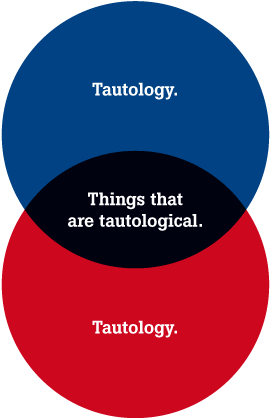

# Como asegurar que un programa no tenga defectos

## ¿Es imposible?


 * _Unknown unknowns_
 * Complejidad creciente
 * Sistemas no funcionan en un vacío

## Formas de atrapar defectos en el desarrollo de software

* Buenas prácticas
* *Pull Request*
* Tests automatizados

# Pruebas en el desarrollo de software

## Testing
* Criterios para asegurar la calidad de un programa.
  * Cumple con sus propósitos.
  * Admite todo tipo de inputs sin causar problemas.
  * Es usable.
  * **No rompe todo el sistema al ser aceptado.**
* Importante en todos los niveles de la organización.

## Manuales


## Automatizados


## Test Levels


---


## Qué debe cumplir un buen test

* Rápido
* Testea interfaces, no implementación
* Detecta bugs
* Consistente
* Claro

<aside class="notes">
Según Dong Woo Kim para _toast-ui_
https://medium.com/@toastui/pragmatic-front-end-testing-strategies-1-4a969ab09453
</aside>

# Testing en Frontend

## ¿Por qué tendría que ser distinto a Backend?

* Difícil tener un _oráculo de la verdad_.


<aside class="notes">
Todo software tiene distintas necesidades. En el backend hay mucha regla de 
negocio, la cual actúa como la verdad. En el frontend esto no es necesariamente 
cierto.
<aside>

___

* Difícil automatizar test visuales.


<aside class="notes">
Hay herramientas para verificar que la interfaz no haya cambiado entre cambios, 
pero no hay nada que reemplace el juicio humano.
</aside>

## ¿Qué se puede hacer?
* Probar manualmente cada cambio.
* Usar herramientas para hacer _visual diffs_.
* Usar herramientas para probar la estructura de la página.
* Ver que al menos la página es compilada (_smoke test_).
* Verificar solo casos con una condición _fail/pass_ concreta.
  * Lógica vs presentación

# Como probar en React

## En general

* Existen herramientas para:
  * ejecutar test unitarios en javascript
  * ayudar en el desarrollo de pruebas (helpers)

## Jest

* Test runner
* Ofrece utilidades para hacer asserts
```javascript
    expect(1).toBe(1);
```

___

* Ofrece utilidades para hacer _mocks_

```javascript
jest.mock('../utils/tealium');
...

expect(tealium.sendView.mock.calls.length).toBe(1);
```

* Puede realizar comparaciones por _snapshots_

```javascript
  expect(component).toMatchSnapshot()
```

--- 

```javascript
exports[`BackButton is rendered correctly when used with a string 1`] = `
<Jss(BaseButton)
  as={[Function]}
  className="primary rounded undefined"
  id="backButton"
  to="link"
  uppercase={false}
>
  <Component />
  <FormattedBackMessage
    defaultMessage="Default message"
    id="INTL_ID"
  />
</Jss(BaseButton)>
`;
```

---

* El uso de snapshots es bueno para asegurar que la estructura de un componente 
  sea consistente.
* No asegura nada visualmente.
* Acoplado a la implementación.
<aside class="notes">
Los snapshots ayudan al menos a saber que la página no cambió su layout 
interno.
No ayudan tanto a saber si algún elemento se corrió por culpa de alguna 
interacción, ya que solo guarda la estructura, no lo visual.
</aside>

## Enzyme

* Creado por _AirBnB_
* Herramienta con helpers para React.
 * Ej: Acceder a _states_, _props_, hijos
* _shallow rendering_
  * Solo se renderea componente.
  * Permite sumergirse en componentes hijos.
  * Evita testear dependencias.


## React Testing Library
>The more your tests resemble the way your software is used, the more 
>confidence they can give you.
> --Kent C. Dobbs

---

* No usa _shallow rendering_ por diseño.
  * Monta el componente con todas sus dependencias.
  * Solo mocks a servicios muy lentos/críticos

```javascript
  fireEvent.click(getByText('Test'));
```

# Recomendaciones

## Enzyme vs React Testing Library

* Ambos hacen tareas similares.
* Distintos enfoques.

___

* Enzyme tiende a introducir más coupling con la implementación.
  * Permite entrar con mayor detalle al estado del componente.
  * Tendencia a que se rompan tests por cambios pequeños

___

* React Testing Library tiene el potencial de ser más robusto
  * Probar simulando a un usuario es bastante intuitivo.
  * No acceder a estado interno no ha sido problema (hasta ahora).
  * Si se rompe test es más significativo.

## Sobre los unit tests

* Importante pensar en pruebas que sean significativas.
  * Deben dar información si se rompen
<aside class="notes">
Ésto lo dijo James O Coplien en "Why most unit tests are a waste"
</aside>

___



___

* Evitar escribir componentes gigantes.
  * Tienen más dependencias
  * Más fácil que se rompan.
* Hacer tests sobre componentes que tengan cambios de estado.

<aside class="notes">
Obviamente no es todo o nada. Separar mucho un componente corre el riesgo de 
que sea más difícil de entender.
</aside>

## Sobre snapshots

* Snapshots son útiles en ciertos casos:
  * Componentes de presentación.
  * Comportamiento se refleja en el árbol de componente.
  * Como _smoke test_.

___

* Pueden traer dificultades asociadas:
  * Falsos positivos: Componente cambia sin que afecte su funcionalidad.
  * Componentes muy grandes:
    * No se entienden bien.
    * Son ignoradas.
